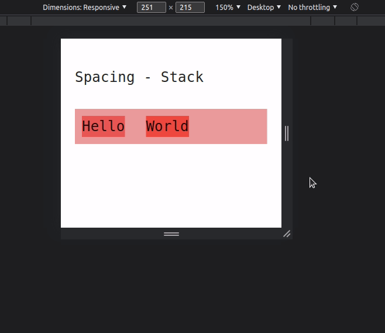
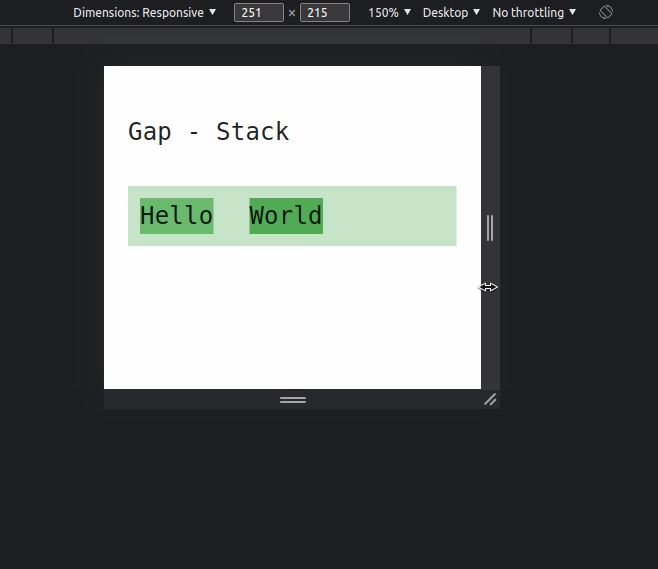
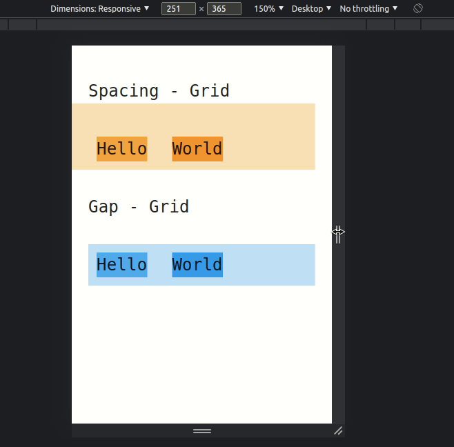

## Gap vs Spacing

There are various ways to deal with spacing within a Mui Grid. `spacing` has always been the "go-to" method, but there
are always a few different options when it comes to making your grid less compact. All of these can work but have a few
weird caveats that a developer should understand.

### Spacing using a Stack

```jsx
<Stack padding={1} spacing={3} direction="row" flexWrap="wrap">
    <Typography>Hello</Typography>
    <Typography>World</Typography>
</Stack>
```

The reason that `World` is shifted to the right is because all `spacing` does is add a `margin-left` to each child
(excluding the first). This does not go away when the wrap happens.

#### Example

I've added some colors to the parent and each child so you can clearly see the boundaries.



### Gap using a Stack

```jsx
<Stack padding={1} gap={3} direction="row" flexWrap="wrap">
    <Typography>Hello</Typography>
    <Typography>World</Typography>
</Stack>
```

#### Example

Using a css property called `gap`, the margin problem goes away. This is because this property actually understands what
is supposed to happen when a flex box is wrapped.



You can see if your targeted browsers support `gap` by visiting the link below:

-   [Can I use a Gap?](https://caniuse.com/?search=gap)

## Grids

Using a Grid instead, you will notice that the negative margins on the grid causes a few problems. These will need to be
solved with a few workarounds to get to the solution with `gap`. Using `gap` is the simplest solution if you can use it.

See here for more information about this:

-   [Negative margins](https://mui.com/components/grid/#negative-margin)
-   [Using material UI Grid spacing](https://stackoverflow.com/questions/61797942/reactjs-using-material-ui-grid-spacing)

### Spacing using a Grid

```jsx
<Grid
    container
    flexWrap="wrap"
    spacing={3}
    sx={{
        padding: 1
    }}
>
    <Grid item>
        <Typography>Hello</Typography>
    </Grid>
    <Grid item>
        <Typography>World</Typography>
    </Grid>
</Grid>
```

### Gap using a Grid

```jsx
<Grid
    container
    flexWrap="wrap"
    sx={{
        gap: 3,
        padding: 1
    }}
>
    <Grid item>
        <Typography>Hello</Typography>
    </Grid>
    <Grid item>
        <Typography>World</Typography>
    </Grid>
</Grid>
```

#### Examples

Below are the two above components with a bit of coloring. You will notice the negative margins but it will functionally
look the same without the colors. While in most cases this does not cause problems, it could cause headaches if you need
to put these grids within another flex-box.

This caused me a problem just building the demo. I had to make my Stack that contained both of these grids have extra
spacing otherwise the margin of the "Spacing - Grid" example would cut off the actual title.



### Thoughts

It is always a good idea to know and weigh all your options when developing. The front-end world is changing so often
where new and better ideas are often lost in the clutter. Surprisingly, writing CSS is sometimes the hardest part of a
developers job because there are so many things that can go wrong and so many different runtime configurations (eg,
browsers).

The developers at Disca are always paying attention to this kind of detail. If you ever need help or consulting on
front-end solutions please don't hesitate to contact us as [hello@disca.tech](mailto:hello@disca.tech) or through the
contact form on our website [disca.tech](https://www.disca.tech/#contact-form).
